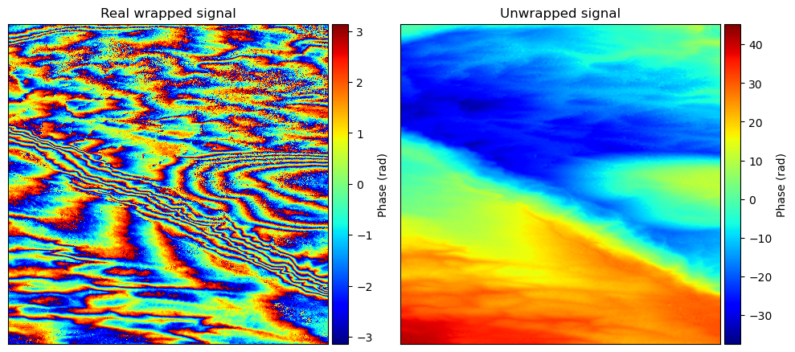
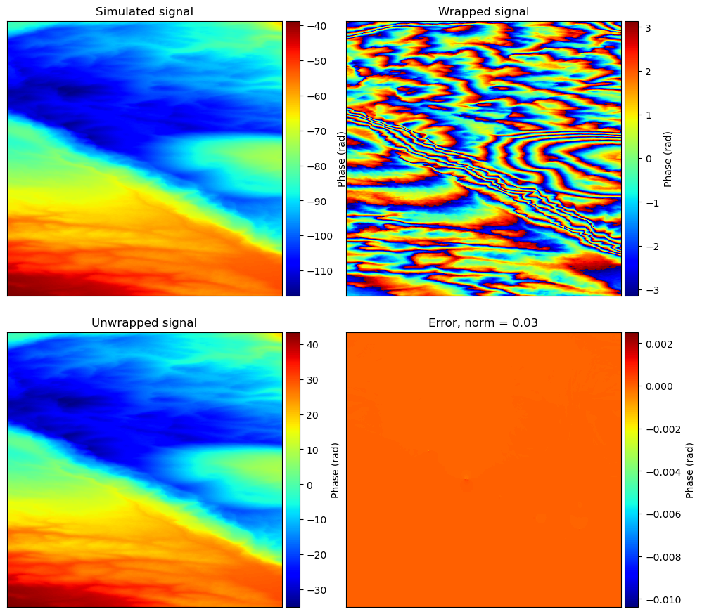

# Phase Unwrapping via Iteratively Reweighted Least Squares

## Installation

Once you have downloaded the repository, we suggest creating a `conda` environment named `phase_unwrapping`.
```
conda env create -f environment.yml
conda activate phase_unwrap
```
We also provide a `requirements.txt` file for user wishing to use another virtual environment manager.

Once this is done, in the root directory of the project, you need to compile SNAPHU. This is only necessary if you plan to use the SNAPHU generated weights in your objective function. We strongly suggest doint it.
```
$ cd snaphu-v2.0.6
$ mkdir bin
$ cd src
$ make
```

## Running experiments

To reproduce the experiments, run in the working directory:

```
$ python final_script.py
```

## Visualize results

To visualize the experiments, simply use the notebook `visualize_results.ipynb`.
For the experiments on real images, the plots should look like the following:



For the experiments on simulated images, the plots should look like the following:



## Citing our work

To cite our our work please use:
TODO
